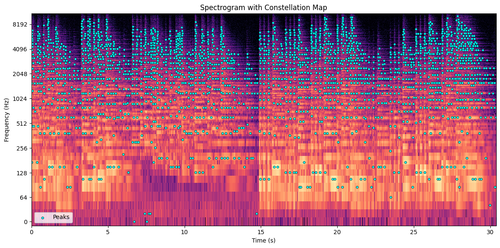

# Audio Fingerprinting & Identification

A Shazam-style audio identification system in Python. It builds a fingerprint database from spectrogram peak constellations and combinatorial hashes, following Wang's *An Industrial Strength Audio-Search Algorithm* (2003), then identifies short query snippets against it.



## How it works

1. **Preprocessing**: resample to 22050 Hz, STFT (FFT size 1024, hop 256), convert to dB and normalise.
2. **Constellation map**: local maxima above an amplitude threshold, capped at the top N peaks per frame and a global target density.
3. **Hashing**: each anchor peak is paired with up to 20 target peaks in a time window; each pair is packed into a 32-bit integer hash (10 bits anchor frequency, 10 bits target frequency, 12 bits time delta).
4. **Indexing**: an inverted index maps each hash to (track, time offset).
5. **Matching**: query hashes are looked up and matches are binned by time offset per track; the three tracks with the largest aligned cluster are returned.

## Results

Tested on a GTZAN subset: 200 reference tracks (100 classical, 100 pop) and 213 query snippets.

| Metric | Score |
| --- | --- |
| Recall@1 | 52.1% (111/213) |
| Recall@3 | 59.2% (126/213) |

Pop queries are identified far more reliably than classical ones, whose wide dynamic range makes the peak constellation either too sparse or too dense.

## Files

| File | Description |
| --- | --- |
| `audio_identification.py` | Main implementation: `fingerprintBuilder(database_path, fingerprints_path)` and `audioIdentification(queryset_path, fingerprints_path, output_path)` |
| `run_demo.py` | Builds the fingerprints and runs identification end to end |
| `evaluate.py` | Computes Recall@1 and Recall@3 from `results.txt` |
| `results.txt` | Output from the submitted run (query, then top 3 matches, tab separated) |
| `setup.sh` | Installs the dependencies |

## Running

The GTZAN audio is not included (third-party dataset, around 430 MB). Put the reference `.wav` files in `database/` and the query snippets in `queryset/`. Query names must follow `<track>-snippet-*.wav` for `evaluate.py` to work.

```bash
pip install -r requirements.txt
python3 run_demo.py
python3 evaluate.py
```

Fingerprints are written to `fingerprints/` and are not tracked in git.
